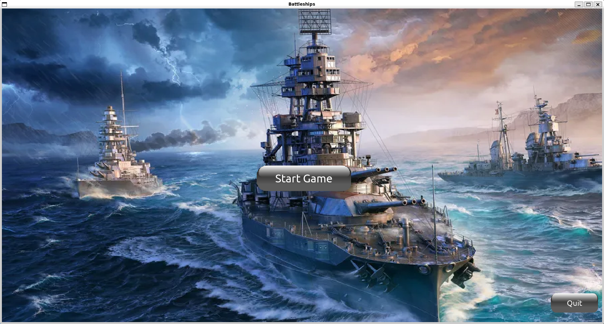
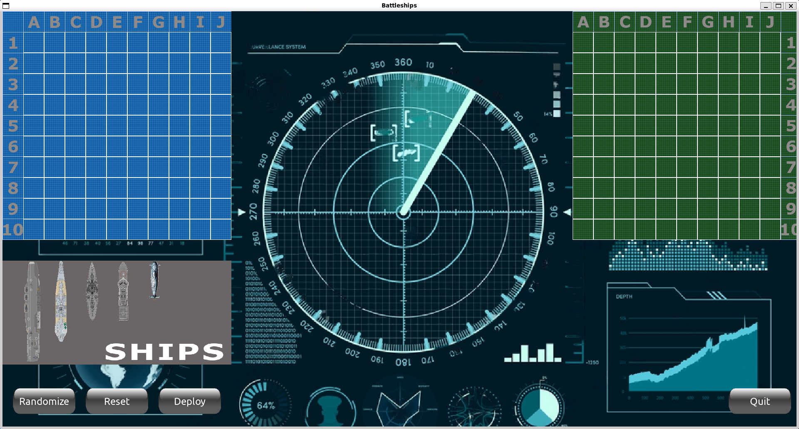

# Projekt Battleships



- [Projekt Battleships](#projekt-battleships)
  - [Dokumentacja w Kodzie](#dokumentacja-w-kodzie)
  - [Dane Autora](#dane-autora)
  - [Cel i Opis Projektu](#cel-i-opis-projektu)
    - [Cel Projektu](#cel-projektu)
    - [Opis Projektu](#opis-projektu)
      - [Instrukcja Gracza](#instrukcja-gracza)
      - [Funkcje Komputera](#funkcje-komputera)
  - [Podział Programu na Klasy i Metody](#podział-programu-na-klasy-i-metody)
    - [Klasy](#klasy)
    - [Metody](#metody)
  - [Instrukcja Użytkownika](#instrukcja-użytkownika)
    - [Wykorzytane moduły](#wykorzytane-moduły)
    - [Instalacja niebędnych modułów](#instalacja-niebędnych-modułów)
    - [Uruchomienie gry w trybie developera](#uruchomienie-gry-w-trybie-developera)
    - [Opis formatu plików konfiguracyjnych](#opis-formatu-plików-konfiguracyjnych)
    - [Testy](#testy)
  - [Wymagania Sprzętowe](#wymagania-sprzętowe)
  - [Część Refleksyjna](#część-refleksyjna)
  - [Zakończenie](#zakończenie)

## Dokumentacja w Kodzie

Dokumentacja w kodzie jest realizowana poprzez tzw. docstrings.

## Dane Autora

**Autor:** Łukasz Szydlik
**Email:** <01187295@pw.edu.pl>

## Cel i Opis Projektu

### Cel Projektu

Celem projektu jest stworzenie interaktywnej gry w statki, która umożliwi graczowi rywalizację z komputerem. Komputer ma za zadanie wykonywać logiczne ruchy, zgodne z zasadami gry w statki.

### Opis Projektu

Gra w statki to klasyczna gra strategiczna, w której dwaj gracze umieszczają swoje statki na planszy i starają się zatopić statki przeciwnika, oddając strzały na przemian. W naszym projekcie gracz będzie miał możliwość rywalizacji z komputerem, który będzie sterował własnymi statkami.

#### Instrukcja Gracza

1. **Rozstawienie statków:**
   - Gracz rozstawia swoją flotę na planszy poprzez wybranie i umieszczenie statku za pomocą lewego przyciskiu myszy. Po wybraniu statku, gracz ma możliwość **obrócenia** okrętu klikając prawy przycisk myszy.
   - Gracz może wybrać również losowe rostawienie za pomoą przycisku **Randomize**
   - Wciśnięcie przycisku **Reset** spowoduje powrót statków na domyślną pozycję
  
2. **Rozpoczęcie rozgrywki:**
   - Po rozstawieniu statków gracz klika przycisk **Deploy**, by rozpocząć rozgrywkę

3. **Oddanie strzału:**
   - W celu oddania strzału, gracz klika pozycję na planszy komputera i zatwierdza ją lewym przyciskiem myszy

4. **Przyciski Menu i Quit**
   - Przycisk **Menu**: Cofnięcie się do menu startowego
   - Przycisk **Quit**: Wyjście z gry

#### Funkcje Komputera

1. **Logiczne Ruchy:**
   - Komputer wykonuje logiczne ruchy, starając się trafiać w statki przeciwnika.
  
2. **Sprawdzanie Poprawności Strzałów:**
   - Komputer nie strzela w pola, w których na pewno nie może być statku

3. **Odkrywanie Reszty Statku:**
   - Po trafieniu komputer stara się odkryć resztę statku, strzelając w pionie lub poziomie.



## Podział Programu na Klasy i Metody

### Klasy

Projekt został podzielony na następujące klasy:

1. **Ship** - *ships.py*
   - Tworzy obiekt z parametrami wejściwoymi: `name`, `image`, `position`, `size`
   - Jest wykorzystywany do reprezentacji statku oraz jego funkcjonalności
   - Metody:
     - create_fleet
     - set_center_point
     - rotate_ship
     - rotate_image
     - draw
     - check_collision
     - return_to_default_potition
     - align_to_grid_edge
     - align_to_grid

1. **Board** - *board.py*
   - Tworzy obiekt z parametrami wejściwoymi: `rows`, `columns`, `cell_size`, `position`
   - Reprezentuje planszę oraz tworzy jej logikę gry
   - Metody:
     - create_grid
     - create_game_logic
     - show_grid_on_screen

1. **Token** - *board.py*
   - Tworzy obiekt z parametrami wejściwoymi: `image`, `pos`
   - Jest wykorzystywany do rysowania na planszy znczników: trafienia, chybienia
   - Metody:
     - draw

1. **Button** - *buttons.py*
   - Tworzy obiekt z parametrami wejściwoymi: `image`, `size`, `pos`, `msg`, `center=False`
   - Jest wykorzystywany do reprezentacji przycisku w grze
   - Metody:
     - add_text
     - focus_on_button
     - action_on_press
     - randomize
     - reset
     - draw

1. **Gamer** - *gamers.py*
   - Tworzy obiekt z parametrem wejściwoym: `board`
   - Jest wykorzystywany do stworzenia klas Player, Bot
   - Metody:
     - clean_logic
     - random_ships_placement
     - update_game_logic

1. **Player** - *gamers.py*
   - Podklasa Gamer
   - Tworzy obiekt z parametrem wejściwoym: `board`
   - Odpowiada za możliwości rogrywki gracza
   - Metody:
     - make_attack

1. **Bot** - *gamers.py*
   - Podklasa Gamer
   - Tworzy obiekt z parametrem wejściwoym: `board`
   - Odpowiada za możliwości rogrywki komputera
   - Metody:
     - find_target
     - make_attack

---

### Metody

1. **set_default_resolution** - *settings.py* - ustawia domyślną rozdzielczość ekranu

1. **read_resolution** - *settings.py* - wczytuje rozdzielczość ekranu z pliku

1. **load_image** - *settings.py* - importuje obrazy

1. **scale** - *settings.py* - skaluje rozmiary w zeleżności od rozdzielczości gry

1. **show_game_logic** - *main.py* - wyświetla w terminalu logikę plansz gry

1. **update_game_screen** - *main.py* - odświeża ekran gry

1. **select_ship_and_move** - *main.py* - służy do początkowego rozstawienia statków przez gracza

## Instrukcja Użytkownika

W celu uruchomienia gry należy uruchomić terminal i przejść do folderu z plikiem main.py

Następnie wpisać komendę:

```python
python3 main.py
```

---

### Wykorzytane moduły

W projekcie zostały wykorzystane następujące moduły:

- standardowe
  - typing
  - random
  - argparse
  - math
- niestandardowe
  - NumPy
  - PyGame

---

### Instalacja niebędnych modułów

W celu zainstalowania niezbędnych modułów należy użyć komendy:

```python
python3 -m pip install -r requirements.txt
```

---

### Uruchomienie gry w trybie developera

Grę można uruchomić w trybie developera poprzez:

```python
python3 main.py -d
```

Umożliwi to użytkownikowi dostep do wyświetlenia aktulanej logiki plansz gry w terminalu poprzez wciśniśnięcie środkowego przycisku myszy.

---

### Opis formatu plików konfiguracyjnych

W projekcie występuje plik konfiguracyjny: **screen_resolution.txt**

W tym pliku użytkownik może wpisać rozmiary ekranu gry (podane w pikselach) zgodnie z następującym formatem domyślnym:

```txt
screen_width=1280
screen_height=720
```

W razie jakichkolwiek błędów, rozmiar ekranu po uruchomienu programu ustawi się na wartości domyślne. Następnie proszę ponownie uruchomić grę.

---

### Testy

Domyślne testy sprawdzjące logikę planszy gry oraz wyjątków związanych z plikiem konfiguracyjnym znajdują się w pliku test_battleships.py i działają poprzez framework pytest.

Komenda do instalacji pytest:

```python
pip install pytest
```

## Wymagania Sprzętowe

Zainstalowany: [Python3](https://www.python.org/downloads/)  
Minimalna rozdzielczość: 800x600

## Część Refleksyjna

- Co udało się osiągnąć:
  - Stworzono w pełni działającą grę statki z interfejsem graficznym.
- Rzeczy, które nie zostały zrealizowane, z komentarzem dlaczego.
  - Nie dopracoano funkcji load_image() znajdującej się w pliku settings.py która przez implementację w złym miejscu już podczas importowania settings.py inicjalizuje ekran gry. Zabrakło czasu na refaktoryzcję kodu poprzez umieszcznie funckji i zładowanie wszytkich grafik w main.py
- Przeszkody napotkane podczas projektu i jak zostały one przezwyciężone.
  - Funkcja która ma na celu dopasowanie statku do planszy, gdy jego fragment w momencie ustawiania wystawał poza planszę nie została idealnie dopracowana. Nie udało się rozwiązać dopasowania do planszy w przypadku, gdy statek jest w większości poza planszą, a dotyka jedynie rogu planszy, gdyż statek ustawiał się w taki sposób, że wystwał poza planszę. W tej sytuacji zdecydowałem się, że w takim przypadku statek powróci na swoją domyślną pozycję i będzie możliwy do ponownego ustawienia.
- Zmiany w stosunku do pierwotnego planu rozwiązania.
  - Pierwtotnie statki miały być rozstawiane bez możliwości sąsiadowania ze sobą. Jednakże przez ograniczoną ilość czasu zrezygnowałem z tej opcji.

## Zakończenie

Dziękuję za uwagę i zapraszam do korzystania z gry!
