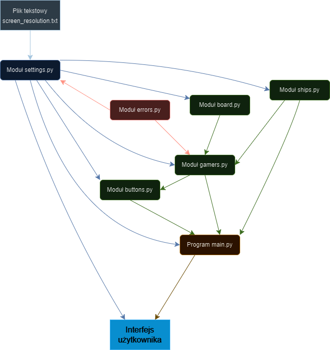

# Project Battleships


- [Project Battleships](#battleships-project)
  - [Code Documentation](#code-documentation)
  - [Author Information](#author-information)
  - [Project Goal and Description](#project-goal-and-description)
    - [Project Goal](#project-goal)
    - [Project Description](#project-description)
      - [Player Instructions](#player-instructions)
      - [Computer Functions](#computer-functions)
  - [Project Structure: Classes and Methods](#project-structure-classes-and-methods)
    - [Classes](#classes)
    - [Methods](#methods)
  - [User Instructions](#user-instructions)
    - [Used Modules](#used-modules)
    - [Installation of Required Modules](#installation-of-required-modules)
    - [Running the Game in Developer Mode](#running-the-game-in-developer-mode)
    - [Configuration File Format](#configuration-file-format)
    - [Tests](#tests)
  - [Hardware Requirements](#hardware-requirements)
  - [Project Architecture Diagram](#project-architecture-diagram)
  - [Reflective Section](#reflective-section)
  - [Conclusion](#conclusion)

## Code Documentation

Code documentation is implemented through docstrings.

## Author Information

**Author:** Łukasz Szydlik  
**Email:** <xxstszydlik@pw.edu.pl>

## Project Goal and Description

### Project Goal

The goal of the project is to create an interactive battleships game, allowing the player to compete against the computer. The computer should make logical moves according to the battleships rules.

### Project Description

Battleships is a classic strategy game where two players place their ships on a board and take turns shooting to sink the opponent's ships. In this project, the player competes against the computer.

#### Player Instructions

1. **Ship Placement:**
   - The player places their fleet by selecting and positioning ships using the left mouse button. Ships can be rotated by clicking the right mouse button.
   - Players can randomly place ships using the **Randomize** button.
   - Pressing **Reset** returns ships to their default positions.

2. **Start Game:**
   - After positioning ships, the player clicks **Deploy** to start the game.

3. **Firing Shots:**
   - To fire, click a position on the computer's board with the left mouse button.

4. **Menu and Quit Buttons:**
   - **Menu**: Returns to the main menu.
   - **Quit**: Exits the game.

#### Computer Functions

1. **Logical Moves:**
   - The computer makes logical moves attempting to hit the player's ships.

2. **Shot Validation:**
   - The computer avoids shooting at positions where ships cannot logically be placed.

3. **Discovering Ship Segments:**
   - After a successful hit, the computer tries to uncover the remaining parts of the ship.


## Project Structure: Classes and Methods

### Classes

The project consists of the following classes:

1. **Ship** - *ships.py*
   - Creates ship objects with parameters: `name`, `image`, `position`, `size`
   - Methods include `create_fleet`, `set_center_point`, `rotate_ship`, etc.

2. **Board** - *board.py*
   - Represents the game board with parameters: `rows`, `columns`, `cell_size`, `position`
   - Methods include `create_grid`, `create_game_logic`, `show_grid_on_screen`

3. **Token** - *board.py*
   - Used for drawing hit and miss markers with parameters: `image`, `pos`
   - Methods include `draw`

4. **Button** - *buttons.py*
   - Represents buttons with parameters: `image`, `size`, `pos`, `msg`, `center=False`
   - Methods include `add_text`, `focus_on_button`, `action_on_press`, `randomize`, etc.

5. **Gamer** - *gamers.py*
   - Base class for players and bots with parameter: `board`
   - Methods include `clean_logic`, `random_ships_placement`, `update_game_logic`

6. **Player** - *gamers.py*
   - Subclass of Gamer, handles player actions.
   - Methods include `make_attack`

7. **Bot** - *gamers.py*
   - Subclass of Gamer, handles computer actions.
   - Methods include `find_target`, `make_attack`

### Methods

- `set_default_resolution`, `read_resolution`, `load_image`, `scale` - *settings.py*
- `show_game_logic`, `update_game_screen`, `select_ship_and_move` - *main.py*

## User Instructions

To run the game, open the terminal and navigate to the folder containing main.py, then execute:

```python
python3 main.py
```

If issues occur, replace `python3` with `python`.

### Used Modules

- Standard: `typing`, `random`, `argparse`, `math`
- Non-standard: `NumPy`, `PyGame`

### Installation of Required Modules

Install required modules using:

```python
python3 -m pip install -r requirements.txt
```

### Running the Game in Developer Mode

Run the game in developer mode with:

```python
python3 main.py -d
```

In developer mode, pressing the middle mouse button shows the current board logic in the terminal.

### Configuration File Format

A configuration file **screen_resolution.txt** sets screen resolution:

```txt
screen_width=1280
screen_height=720
```

If incorrect, the game defaults to preset values. Restart the game after corrections.

### Tests

Default tests checking board logic and exceptions related to the configuration file are in `test_battleships.py` using pytest.

Install pytest:

```python
pip install pytest
```

## Hardware Requirements

- Python3 installed ([Python.org](https://www.python.org/downloads/))
- Minimum resolution: 800x600

## Project Architecture Diagram

The project uses **monolithic architecture**, where all components such as user interface, business logic, and data layer are integrated into one unit.



## Reflective Section

- Achievements:
  - Created a fully functional battleships game with a graphical interface.
- Unimplemented Features and Reasons:
  - Did not refine `load_image()` due to incorrect initialization causing issues. Lacked time for proper refactoring.
- Obstacles and Solutions:
  - The ship alignment function was incomplete; ships partially off the board returned to default positions as a workaround.
- Changes from Original Plan:
  - Originally intended to disallow adjacent ships, but removed due to time constraints.

## Conclusion

Thank you for your attention and enjoy playing!

